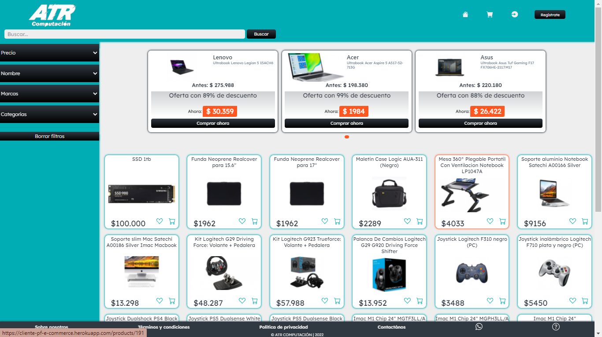
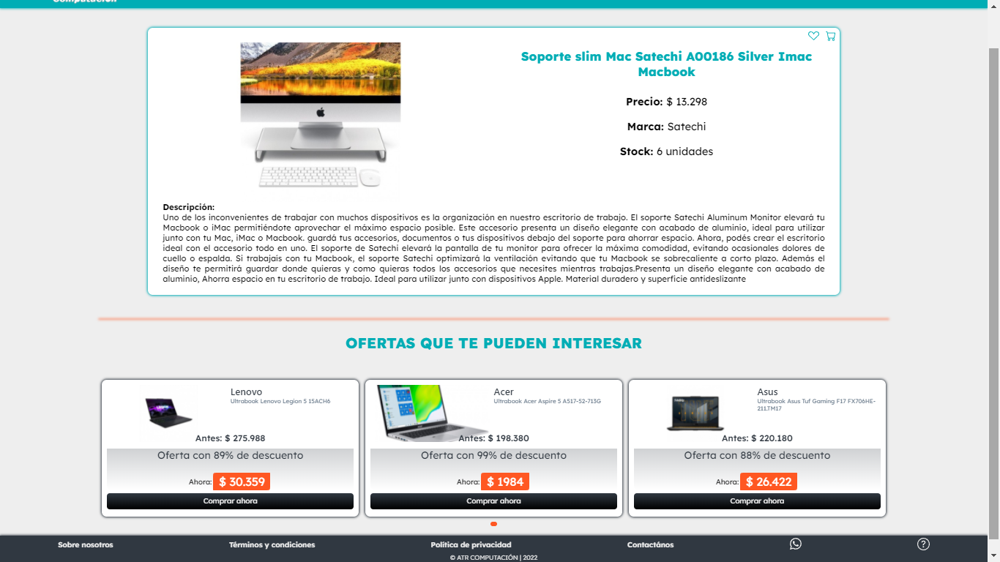
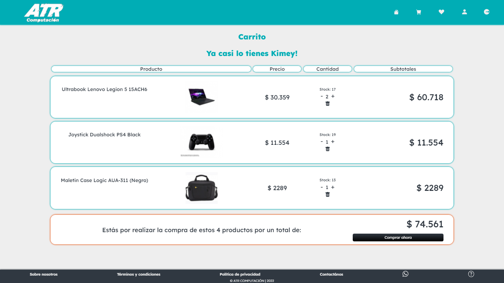
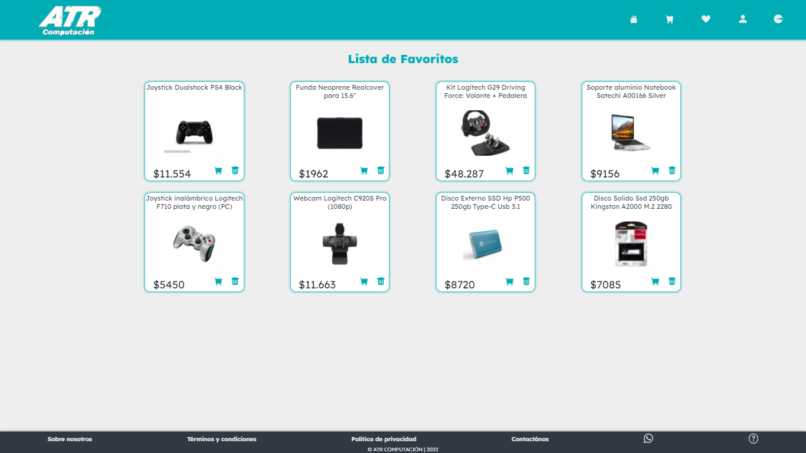
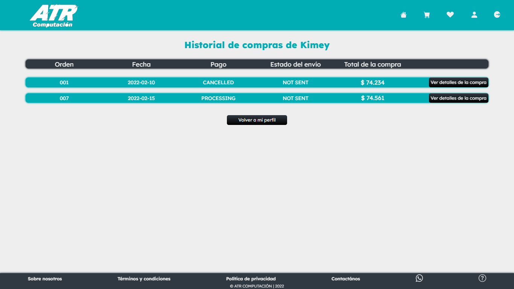
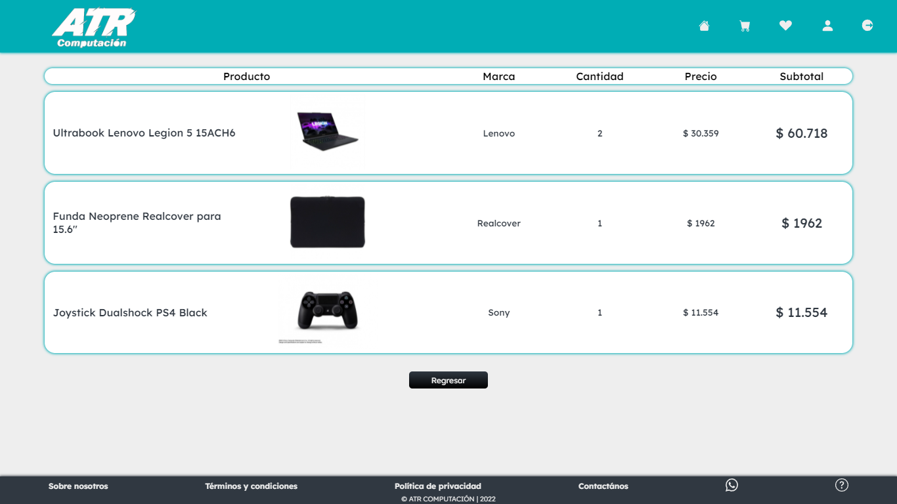
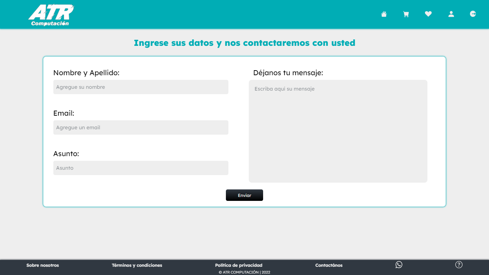
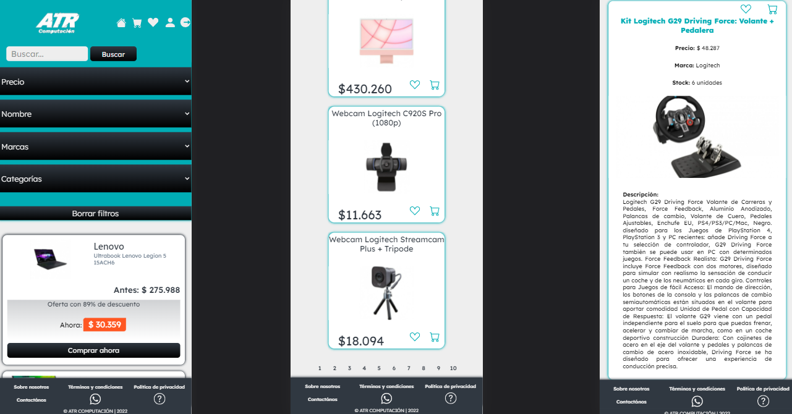
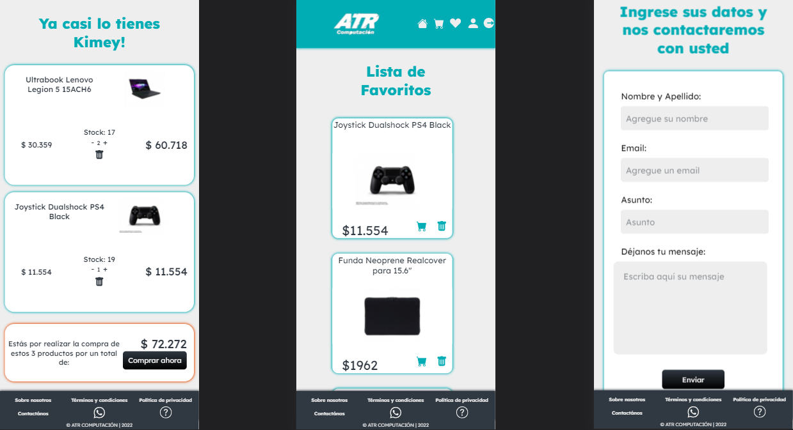

# look at the project deployed

Client

https://cliente-pf-e-commerce.herokuapp.com/

Admin

https://boring-dubinsky-207e29.netlify.app/

User: e_commerce@gmail.com

pwd: admin

## HOME

## PRODUCT DETAIL

## CART

## WISHLIST

## HISTORY

## CONTACT FORM

## MOBILE

